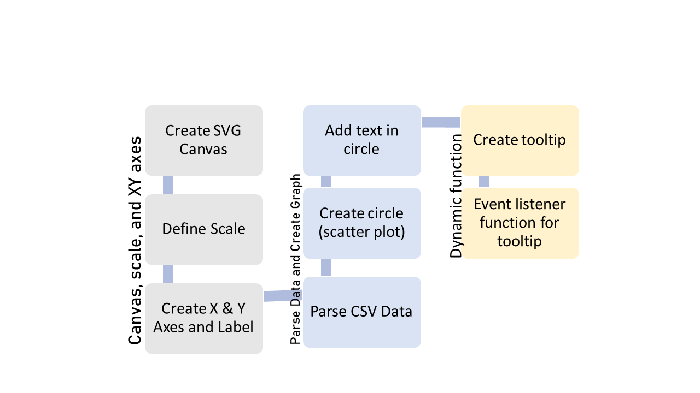
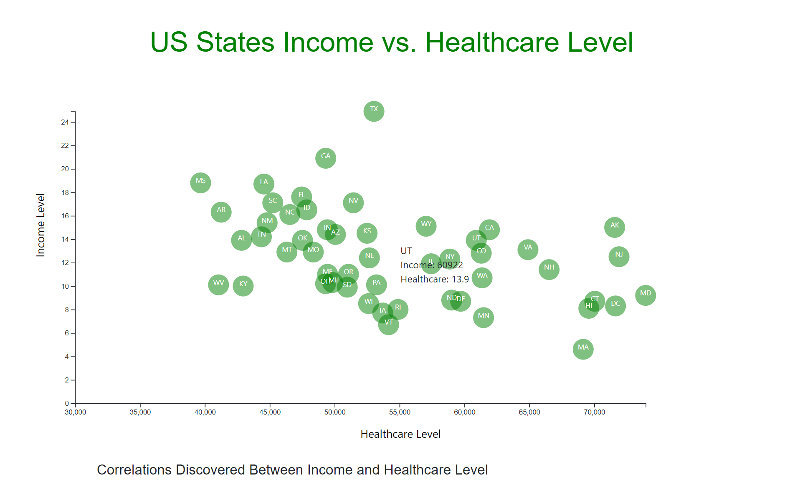
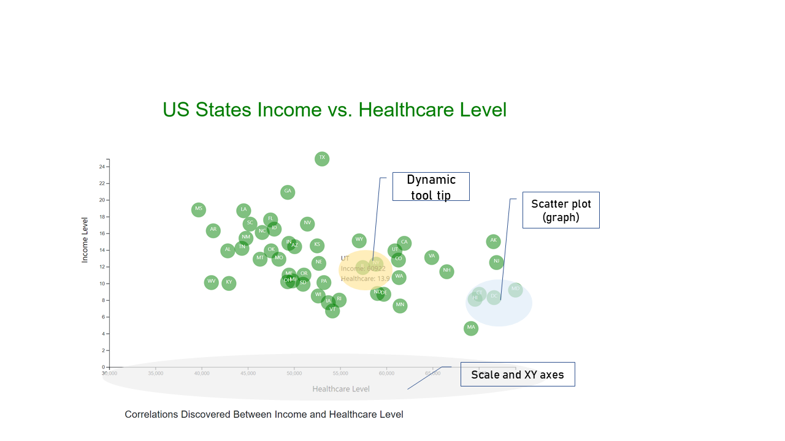

# Plotly Challenge

### 1. Background 

**Project Background:** In this D3 project, we will plot Health and demographic data from `data.csv` and plot a graph with D3. Later on, we will create a dynamic visualization. 

### 2. Methodology 

**Methodology:** We will use Javascript, D3, HTML, and CSS for this challenge. In working with D3, there are several compontents. 

These are the explanation. While creating D3, there are 3 big components to be focused: 
1) The SVG canvas (size and display), X Y axes (scale, range, label)
2) The actual graph and how to parse the data (create circle, append text, read the CSV files)
3) The dynamic of visualization (tooltip)

### 3. Result (Static)

This graph visualize the correlation between healthcare level (x axis) and income level (y axis) for all US states. Every circle represent 
the position of US states. 

### 4. Result (Dynamic)

While each circle contain several values, we can see the values more clearly by hovering the mouse into individual circle. 
To achieve this, an event listener function will be embededed to show the tooltip. We will determine 
type of 'dynamic script' that will run. In this example, a `mouseover` and `mouseout` will highlight the tooltip value. 

* File output for html code is  `index.html` 
* File output for Javascript code is  `app.js` and `bonus.js`

